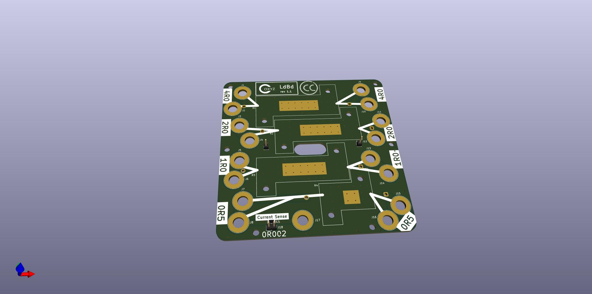

# ldBd
Simple Load Board for Power Supply Testing

This is a very simple PCB design to act as a power supply load board.  
Yes, there are fancy load boards available out there with digital readouts, fans, etc.
This goes opposite that - it is ***trivially simple***.
This is a simple 2 sided PCB 100mm X 100mm with 50 and 25 watt power resistors that can
be connected various ways using banana plug jumpers.
(See notes on the back of the PCB for some options)
It's a bit if a squeeze getting everything to fit, but staying at 100X100 keeps it inexpensive.

You can have 5 bare PCB's fabricated for you in China for just a few dolilars (plus shipping!)
For example $2.00 from https://jlcpcb.com. The files needed for PCB manufacturing are in the gerbers/ 
directory.  The design was done in KiCad version 7.0, and the kicad* files can be used to
modify it further, if you wish.

The power resistors are connected to the board mounting holes via short soldered jumpers.
The whole top and bottom surfaces are mostly big copper pours, so resistor heat is spread across the entire board.

I haven't generated an official BOM, but the parts list is fairly obvious:
- R1 is a 4 ohm, 50 watt power resistor
- R2 is a 2 ohm, 50 watt power resistor
- R3 is a 1 ohm, 50 watt power resistor
- R4 is a 0.5 ohm, 25 watt power resistor
- J1-17 (17 items) are banana jacks. I used black on one side and red on the other, but .. whatever you want.
- If you want the current sense option, J18 is a 1X2 0.1" pin header, and R5 is a 0.002 ohm 1206 sized surface mount resistor. Both are easy to hand solder.
- You will also need some M3 bolts&nuts - or similar - to hold the resistors down.
- and of course you need to make or buy banana plug jumpers.

Talking about parts; I am US based. The load resistors are available from most any electronics
distributor - Digikey, Mouser, Newark, ...  However, the only place I could find banana jacks
and plugs at a reasonable price (I don't consider > $1 each to be reasonable) was from China.  
The jacks&plugs I used were from AliExpress - and YES as you can see from the next picture - 
*the same supplier gave me 2 different types*!

I 3d printed a simple base for the board.  The stl file for that is in the case/ directory.
Since the boardi CAN get warm,I would recommend PETG or an alternate material with a higher
glass transition temperature than PLA.
And here's ***my*** finished product!

Usage is simple - you need to know `e = i * r` and how to calculate effective parallel and series resistances.
(Again, see the notes on the back of the board for some ideas)
Also - ***Use common sense***. Do not exceed the resistor ratings.  I have found dissipating even 20 watts
for 5-10 minutes on this board can make it get very warm. Use a fan if needed to increase heat transfer!

You may use, share, or modify this design, but per the CC BY 4.0 License, please give "Rick Cox" credit.

This work is licensed under the Creative Commons Attribution 4.0 International License. To view a copy of the license, visit https://creativecommons.org/licenses/by/4.0/
