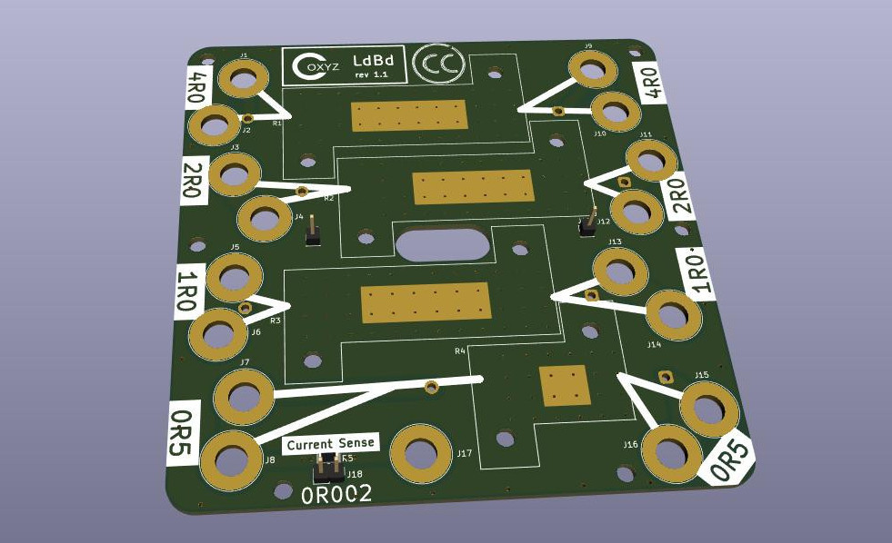

# ldBd
Simple Load Board for Power Supply Testing

This is a very simple PCB design to act as a power supply load board.  
Yes, there are fancy load boards available out there with digital readouts, fans, etc.
This goes opposite that - it is ***trivially simple***.
This is a simple 2 sided PCB 100mm X 100mm with 50 and 25 watt power resistors that can
be connected various ways using banana plug jumpers.
(See notes on the back of the PCB for some options)
It's a bit if a squeeze getting everything to fit,but staying at 100X100 keeps it inexpensive.

You can have 5 bare PCB's fabricated for you in China for just a few dolars (plus shipping!)
For example $2.00 from https://jlcpcb.com. The fFiles needed for PCB manufacturing are in the gerbers/ 
directory.  The design was done in KiCad version 7.0, and the kicad* files can be used to
modify it further, if you wish.

I haven't generated an official BOM, bur the materials list is fairly obvious
- R1 is a 4 ohm, 50 watt power resistor
- R2 is a 2 ohm, 50 watt power resistor
- R3 is a 1 ohm, 50 watt power resistor
- R4 is a 0.5 ohm, 25 watt power resistor
- J1-17 (17 items) are banana jacks. I used black on one side and red on the other, but .. whatever.
- If you want the current sense option, J18 is a 1X2 0.1" pin header, and R8 is a 0.002 ohm 1206 sized surface mount resistor.

I 3d printed a simple base for the board.  The stl file for that is in the case/ directory.
And here's ***my*** finished poroduct!
o

This work is licensed under the Creative Commons Attribution 4.0 International License. To view a copy of the license, visit https://creativecommons.org/licenses/by/4.0/
